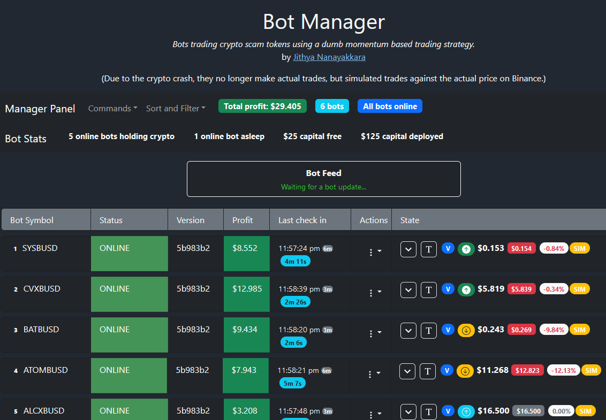

# Crypto Bots

## About

A project to see if I could get bots to trade crypto for a profit.

It was a failure, as it only generated a consistent profit during a bull market, because it didn't matter when the bot purchased crypto - it'd inevitably rise enough to make a profit.

The bots no longer make actual purchases, only simulated trades based on the actual price on Binance. You can view the deployed bot manager at http://ponzibots.com

## Structure

The project is a monorepo, consisting of the following projects:

- **analysis:** Scripts for attempting to simulate the bot's performance on historical price data.
- **bot:** The actual crypto trading bot.
- **db:** Microservice in front of the database component. The bot logs its trades on a MariaDB database on the server, via this db microservice.
- **lib:** Shared library among the monorepo projects.
- **manager:** This is the bot manager. Each bot registers and sends status updates to the manager. The manager maintains a websocket with the UI to update the bot status.
- **ui-mgr:** A React SPA that provides a table view of all the bots and their current status and performance.
